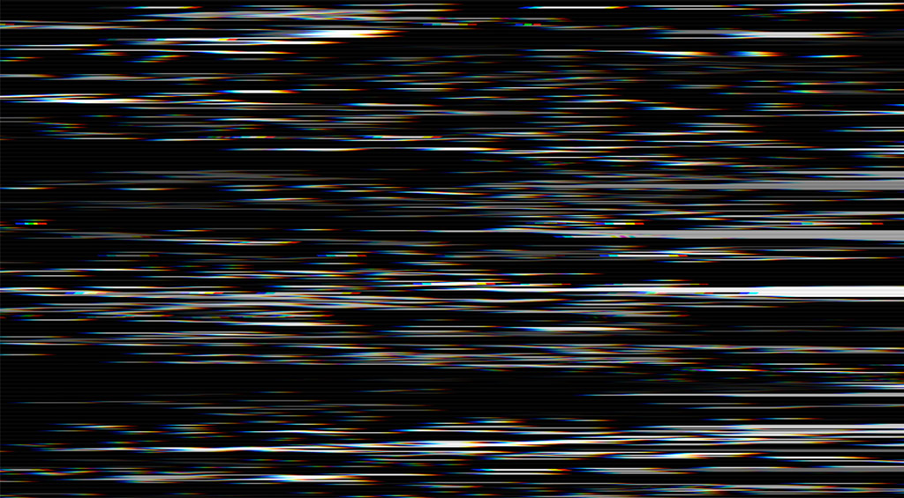

# Continuum

A framework for live performing processing based visuals using [controlP5](https://github.com/sojamo/controlp5), [syphon](http://syphon.v002.info) and some midi interfaces.

_gui screenshot_

_visual landcape_

_visual modernist_

